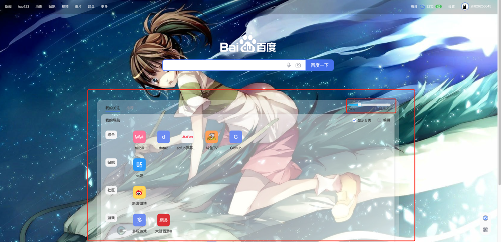

# 我的油猴脚本库

## 给百度页面增加透明效果
自定义的百度本来是可以调节透明度的，后来不知道什么原因去掉了这个功能，只能自己来动手了
### 脚本
[change_baidu_navigation_bar.js](./change_baidu_navigation_bar.js)
### 效果

## 手机页面自动跳转到 PC 页面
一些网站的手机页面不会自动跳转到 PC 版页面，造成 PC 访问体验很差

目前适配的网站
- 京东商品详情页
- 虎扑帖子页面
- 微博详情页
## 脚本
[app_url_to_pc.js](./app_url_to_pc.js)
