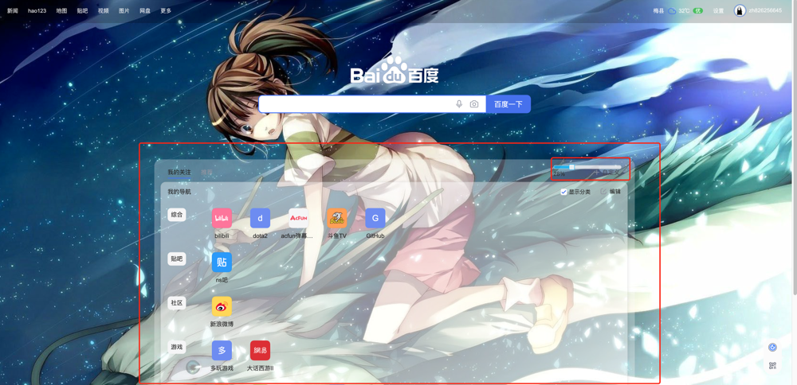
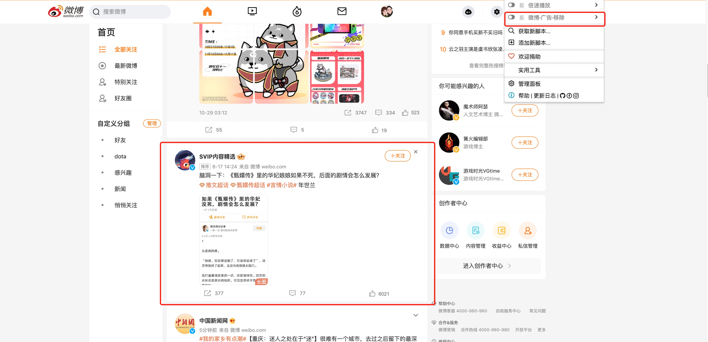
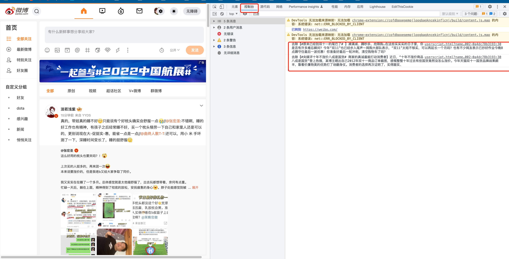

# 我的油猴脚本库

## 1. 给百度页面增加透明效果
自定义的百度本来是可以调节透明度的，后来不知道什么原因去掉了这个功能，只能自己来动手了
### 脚本
[change_baidu_navigation_bar.js](./change_baidu_navigation_bar.js)
### 效果

## 2. 手机页面自动跳转到 PC 页面
一些网站的手机页面不会自动跳转到 PC 版页面，造成 PC 访问体验很差

目前适配的网站
- 京东商品详情页
- 虎扑帖子页面
- 微博详情页
### 脚本
[app_url_to_pc.js](./app_url_to_pc.js)
## 3. 去除微博广告
浏览器刷微博时经常夹杂广告推送，并且内容质量很差，直接去除
### 脚本
[remove_weibo_advertising.js](./remove_weibo_advertising.js)
### 效果

## 4. 下载文件名和复制名称保持一致
给无损音乐下载站点增加下载文件名修正，点击弹窗中的“点击下载”时，实际保存文件名和“复制名称”一致。
### 脚本
[music_download_filename_sync.js](./music_download_filename_sync.js)

## 5. 替换 Gemini 网页的字体以区分大写 I 和小写 l
由于 Gemini 网页默认字体难以区分大写字母 `I` 和小写字母 `l`，本脚本将对话消息、提问和输入框字体替换为更易辨识的 Verdana 字体，同时保持代码块的等宽字体并确保系统图标正常显示。
### 脚本
[gemini_font_replacer.js](./gemini_font_replacer.js)

